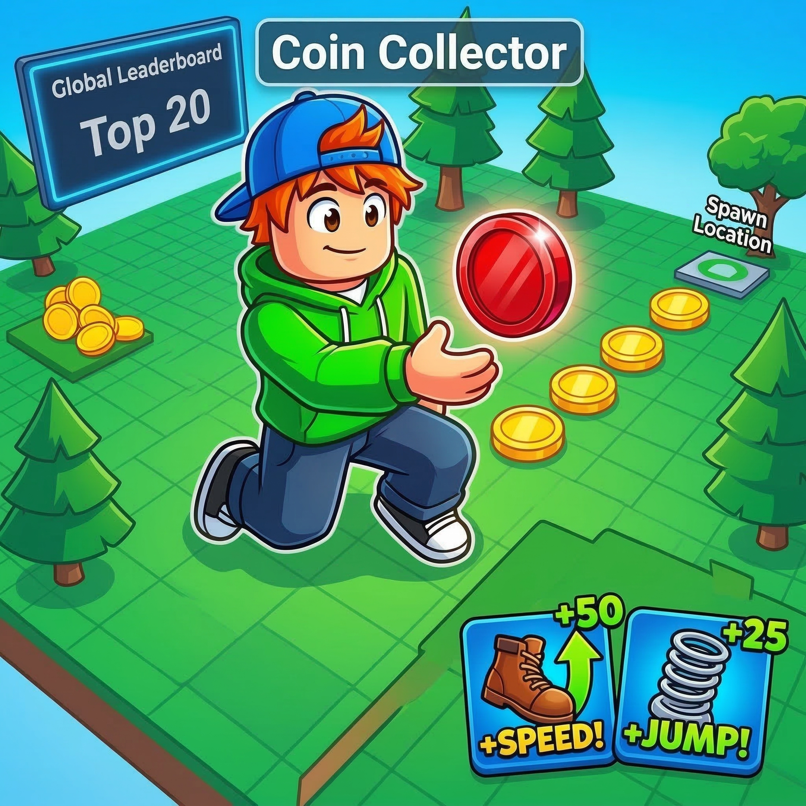
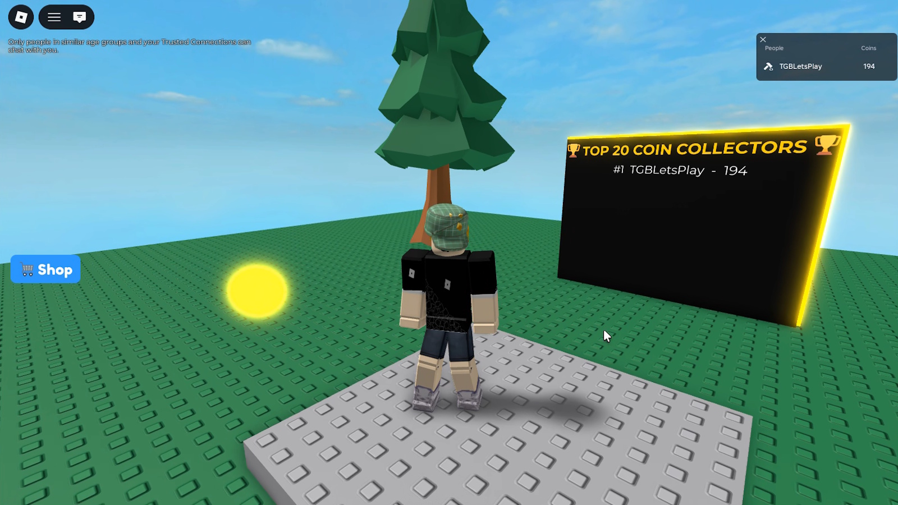
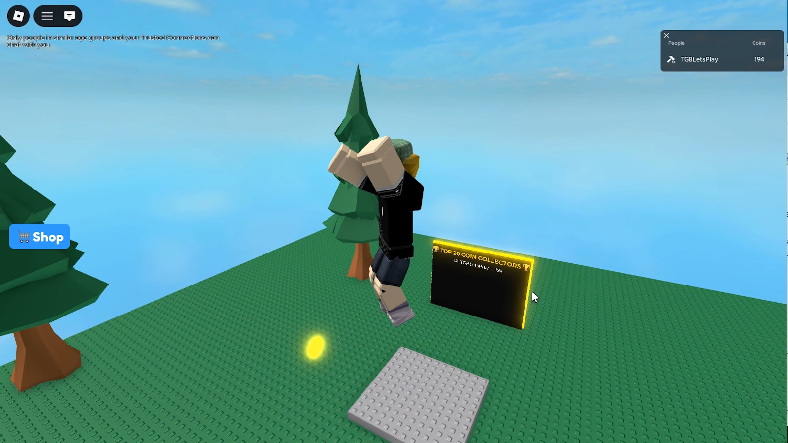
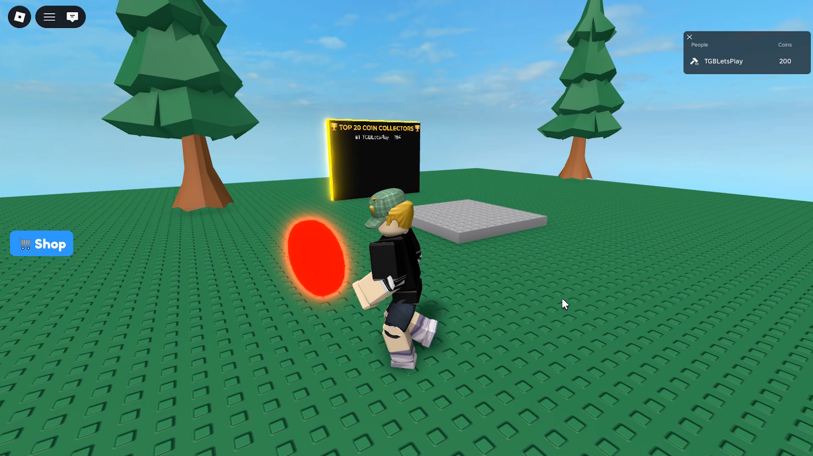
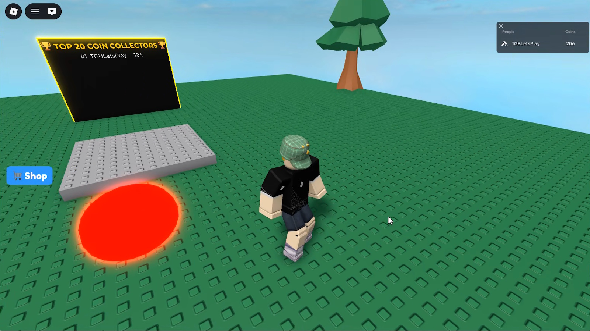
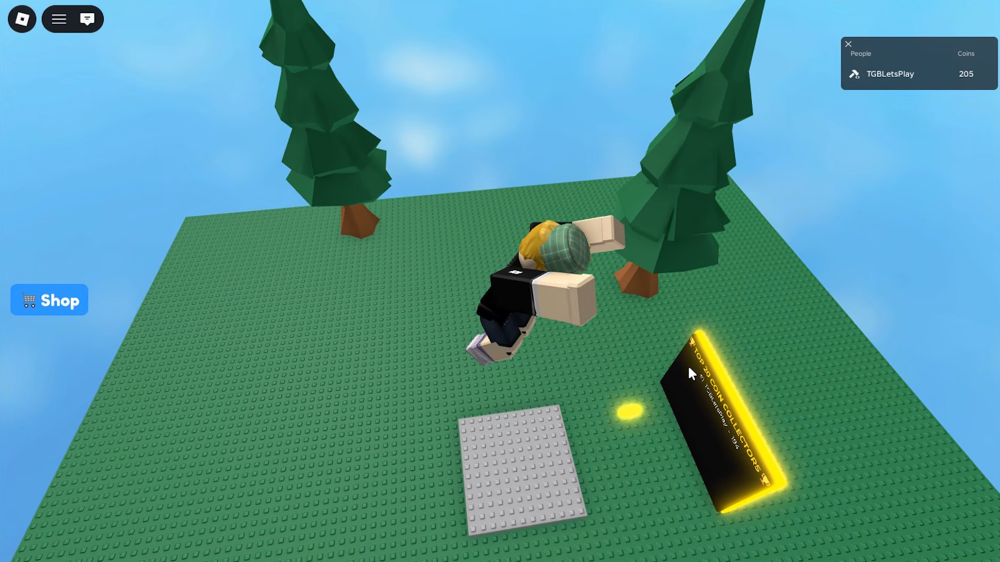

<div align="center">
  
  <h1>🎮 Simple Roblox Game 🎮</h1>
  <p><b>A basic but complete starting point for a professional Roblox game, featuring modular server architecture, unit testing, and continuous integration!</b></p>
  
  [](https://www.roblox.com/games/94459019303992/Simple-Roblox-Game)
  <br/>
  
  
  
  
  <br/>
  [](https://github.com/thegamerbay/simple-roblox-game/actions/workflows/ci.yml)
  [](https://github.com/thegamerbay/simple-roblox-game/releases)
  [](https://opensource.org/licenses/MIT)
</div>

<br/>

The project demonstrates an elegant synchronization process between your local IDE (VS Code) and Roblox Studio using **Rojo**, strict package management using **Wally**, and toolchain management using **Aftman**.

---

## 📸 Gallery

<p align="center">
  
  
</p>
<p align="center">
  
  
  
</p>

---

## 🎯 Gameplay & Objectives

This project isn't just a foundation; it comes with a built-in game loop that perfectly demonstrates core client-server interactions in Roblox:

* **Objective:** Collect the glowing coins that spawn randomly around the map.
* **Mechanics:** 
  * Coins look like real flat coins (cylinders). Their smooth hovering and rotating animations are calculated **100% locally** on the client's machine (`ClientCoinAnimator.lua`), completely eliminating network replication lag and server-side ping spikes.
  * As soon as a player's character touches a coin, it plays a pleasant sound, emits spark particles, and is instantly collected.
  * There's a **20% chance** to spawn a **Rare Red Coin** that grants **5 points** instead of the usual 1 point for a yellow coin!
  * The player's **Leaderstats** track the collected coins and update their score locally.
  * **Global Leaderboard (Top 20):** A stylish neon 3D screen sits in the game world, automatically tracking and displaying the top 20 player scores globally using `OrderedDataStore`. It refreshes every 60 seconds.
  * **Upgrade Shop:** Players can spend their coins to purchase character upgrades (e.g., Walk Speed and Jump Height) through a beautiful UI (`ClientShop.lua`). The server securely validates all purchases (`ShopManager.lua`) and attributes are used for state synchronization. Prices scale exponentially and purchases persist between sessions!
  * **Data Persistence & Auto-Save:** Player's coin balances and shop upgrades are securely saved to Roblox's cloud databases (`DataStoreService`) using dictionaries upon leaving, and seamlessly restored from the `PlayerCoinsStore` the next time they join. An **Auto-Save** background process also protects data by saving all active players' progress every 60 seconds.
  * **Environment Generation:** A dedicated `EnvironmentManager` dynamically downloads random tree models via `InsertService`, sanitizes them of any potential malicious scripts, and distributes them evenly across 5 distinct zones on the map.
  * **Safe Spatial Queries:** Both the coins and trees utilize Roblox's `Workspace:GetPartBoundsInBox()` spatial query engine. This guarantees that objects are never accidentally spawned inside the Leaderboard, the spawn location, or each other, filtering out the baseplate using `OverlapParams`.
  * The server then automatically spawns a brand new coin nearby.
  * **Background Music:** A client-side music player module continuously plays classic Roblox tracks in a loop (`MusicPlayer.lua`).
* **Technical Highlights:** This loop acts as a brilliant, easy-to-read example of strict Luau type checking (`--!strict`), creating isolated, testable **ModuleScripts** (e.g., `ShopManager.lua`, `MusicPlayer.lua`), utilizing `TestEZ` for **100% specification test coverage** across both server and client domains. The game securely keeps the logic state on the server while the client handles purely visual effects via `CollectionService` tags, effectively using `OrderedDataStore` for asynchronous global ranking, and safely interacting with Roblox's physics engine. Memory leaks are proactively prevented using the `Trove` design pattern upon coin collection.

---

## 🛠️ Tech Stack & Tooling

This project uses modern Roblox development standards:
* **[Rojo](https://rojo.space/)**: Syncs external files into Roblox Studio.
* **[Aftman](https://github.com/LPGhatguy/aftman)**: Cross-platform toolchain manager for Roblox CLI tools (Rojo, Wally, Selene).
* **[Wally](https://wally.run/)**: The package manager for Roblox. We use it to pull our testing framework, **TestEZ**, and memory management toolkit, **Trove**.
* **[Selene](https://kampfkarren.github.io/selene/)**: A blazing fast linter crafted specifically for Luau and Roblox standard libraries.
* **[GitHub Actions](https://github.com/features/actions)**: Automated CI/CD pipelines checking code quality. We use the **Roblox Open Cloud Luau Execution API** to run our TestEZ test suites directly on Roblox servers without needing a vulnerable `run-in-roblox` pipeline!

---

## ⚡ Setup Guide

### Step 1: Getting the Project & Tools
1. Clone the repository: `git clone https://github.com/thegamerbay/simple-roblox-game.git`
2. Open the folder in VS Code.
3. Install the tools using Aftman:
   ```bash
   aftman install
   ```
4. Install Roblox library dependencies using Wally:
   ```bash
   wally install
   ```

### Step 2: Running Rojo
1. Install the official **Rojo** extension by `evaera` in VS Code.
2. Open the VS Code Command Palette (`Ctrl+Shift+P`) and choose `Rojo: Start server`.

### Step 3: Connecting Roblox Studio
1. Open up an empty modern **Baseplate** in Roblox Studio.
2. Under the **Plugins** tab, click **Rojo** and then **Connect**.
3. *Magic!* Your scripts and Wally packages instantiate perfectly into `ServerScriptService` and `ReplicatedStorage`.

### Step 4: Playtesting & Unit Testing
1. Press **Play** (`F5`) in Roblox Studio.
2. Run into the floating coin to pick it up and see your points increase on the leaderboard.

### Step 5: Configuring Open Cloud CI/CD & Deployments (GitHub Actions)
Our automated tests and release deployments run on GitHub Actions using official Roblox Open Cloud APIs. To enable this in your fork:
1. Create two places in Roblox Studio: a **Test Place** (for CI) and a **Production Place** (for releases).
2. Go to the [Roblox Creator Dashboard](https://create.roblox.com/docs/cloud/open-cloud/api-keys) and generate an Open Cloud API Key.
3. Grant it the `universe.places:write` and `universe.place.luau-execution-session:write` permissions for **both** your Test and Production Places.
4. Add the API Key as a Secret in your GitHub repository named `ROBLOX_API_KEY`.
5. Add your Place IDs as Repository Variables:
   * `ROBLOX_TEST_UNIVERSE_ID` & `ROBLOX_TEST_PLACE_ID` (for automated PR tests)
   * `ROBLOX_PRODUCTION_UNIVERSE_ID` & `ROBLOX_PRODUCTION_PLACE_ID` (for automated deployments when you tag a release e.g. `v1.0.0`)

Tests and deployments will now automatically run (and skip safely if the key isn't provided) when you push code or publish releases!
### 🔍 Linting Locally
To run the Selene linter locally before pushing code:
```bash
selene src
```

---

## 🙏 Acknowledgements

Special thanks to the official [Roblox place-ci-cd-demo](https://github.com/Roblox/place-ci-cd-demo) repository, which served as an invaluable reference for figuring out how to run tests and deploy via the new Engine Open Cloud API!

---

## 📄 License

This project is licensed under the [MIT License](LICENSE). You are free to use, modify, and distribute this project as you see fit.
